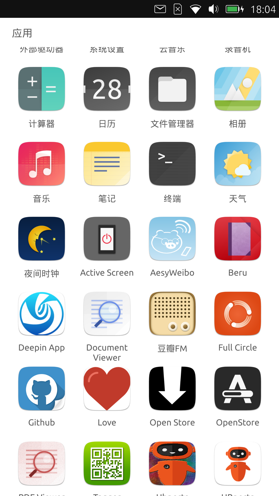
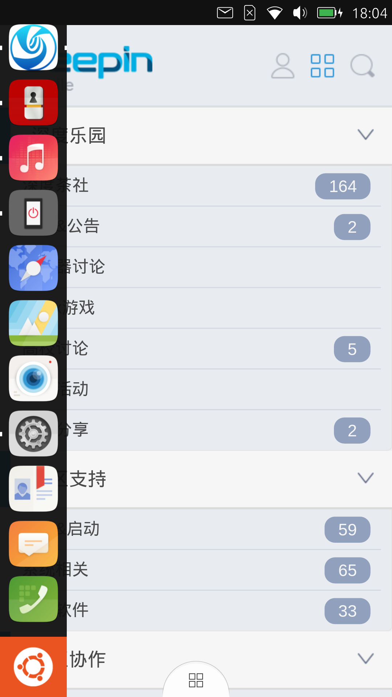
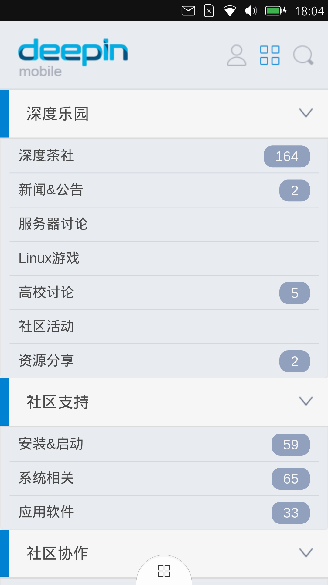

# deepin-app
Deepin BBS App for Ubuntu Touch.

## Screenshots

  
  
  

## Install

You can find & install it from [OpenStore](https://open.uappexplorer.com/app/deepin-app.mutse).

Copyright (C) 2017 [Mutse Young](https://mutse.github.io)
